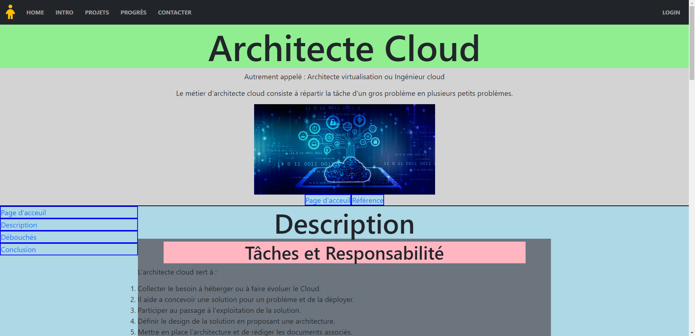
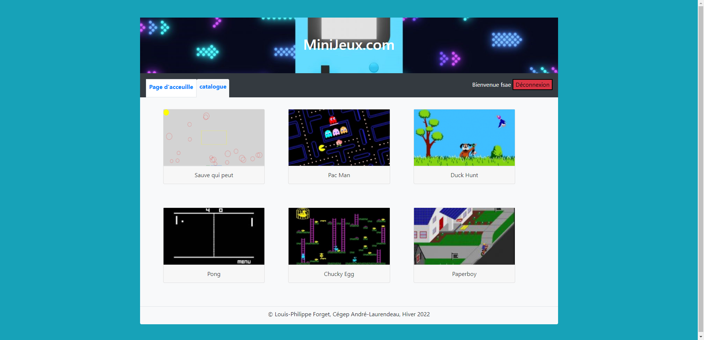
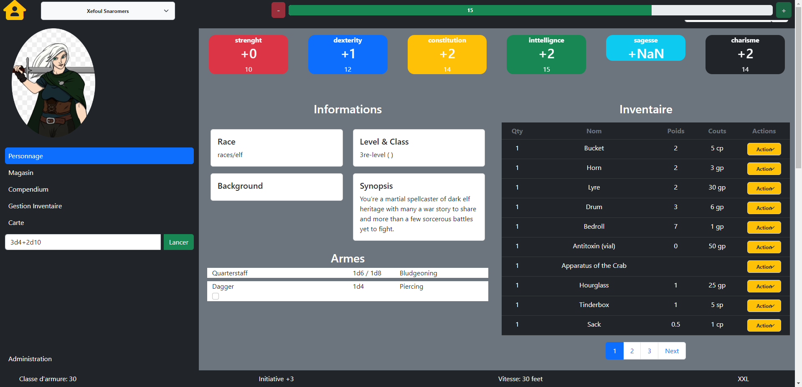
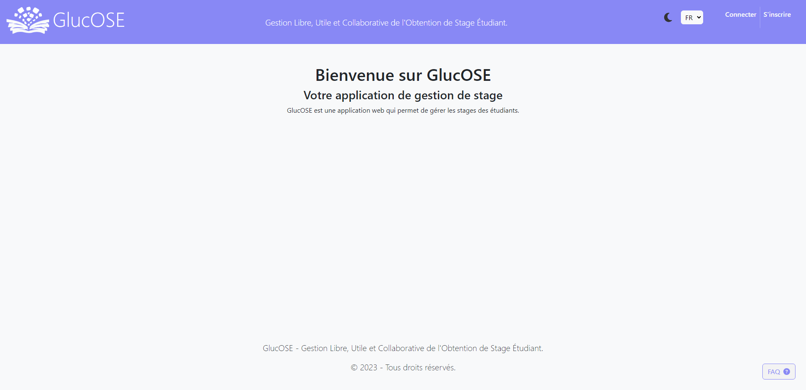

# Bienvenue sur mon Portfolio !

Je suis Louis-Philippe Forget, un développeur d'applications web passionné par la création d'expériences numériques exceptionnelles. Explorez mes réalisations ci-dessous :

## Architect Cloud

Plongez dans l'univers d'Architect Cloud, un projet captivant qui offre une expérience immersive. En collaboration avec d'autres esprits créatifs, j'ai contribué à donner vie à cette vision unique.

## Portail de Jeux

Découvrez un monde ludique à travers mon projet de Portail de Jeux. En tant que créateur, j'ai conçu des expériences de jeu engageantes qui suscitent l'enthousiasme des utilisateurs.

## Dungeon & Dragons

Embarquez pour une aventure fantastique avec Dungeon & Dragons. J'ai développé ce projet avec passion, en apportant des fonctionnalités innovantes pour une expérience de jeu encore plus captivante.

## Projet Glucose

Une collaboration passionnante avec Gabriel, Chouaki Bendamane, Samuel Gignac et Zakaria, le projet Glucose repousse les limites de la technologie pour créer quelque chose de vraiment exceptionnel.

Explorez ces projets pour avoir un aperçu de mon savoir-faire en matière de développement d'applications web. Chacun de ces projets représente un défi unique que j'ai relevé avec créativité et détermination. N'hésitez pas à cliquer sur les liens pour en savoir plus sur chaque projet. Merci de visiter mon portfolio, et n'hésitez pas à me contacter pour discuter de nouvelles opportunités passionnantes !
